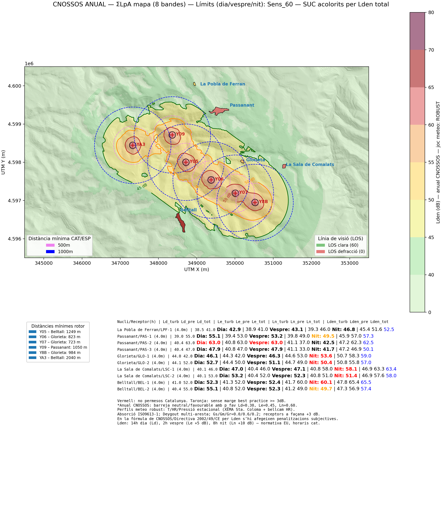

# Noise Impact Assessment

**If you encounter any issues, please don't hesitate
to [report them](https://github.com/leotiger/cnossos-assessment/issues).**

The **CNOSSOS NOISE IMPACT ASSESSMENT** allows you to simulate, determinate and visualize noise impacts for planned infrastructures.
The tool implements the [EUROPEAN CNOSSOS PROTOCOL assessment](https://op.europa.eu/es/publication-detail/-/publication/80bca144-bd3a-46fb-8beb-47e16ab603db) and allows for local adaptations, e.g. for Catalonia, Spain, etc.

The tool is not meant for oficial documentation, this tool helps you to verify acustic impact studies provided by promotors for their projects within the process to obtain environmental approval for their proposed projects.

Nevertheless, the **CNOSSOS Assessment** obtains reliable results comparable to professional assessment tools used by the industry.

## Installation

CNOSSSOS ASSESSMENT is a command line script for python.
Your python enviroment needs to be setup to support all necessary libraries.
Please use conda or pip to install all missing libraries if the script complains on execution.

## Requirements

python with support for:

- matplotlib
- rasterio
- numpy
- shapely
- numba

The rest of imported libraries should be available within your standard python environment.

## Configuration

The Cnossos Assessment tool reads project configurations via command line args using a .yaml file to 
obtain essential project data, e.g. wind turbine(s) data, receptors data, elevation map data (DEM)...

The tool offers three scenarios (robust|central|sec) which can be called via the "-s" or --scenario flag. The "robust" scenario is conservative and allows you to establish an interpretation frame for data and simulations included within project documentations.

To run assessments for specific projects you'll have to gather a lot of data first. Once you have the data available you can edit the assessment configuration .yaml for the wind park you want to investigate. You provide your .yaml configuration via the --config (-c) flag.

To run the assessment tool you will need to provide a DEM tiff file and you need to prepare the oficial DEM files into a unique set that reflects the terrain afected. Below you'll find an example to produce an elevation raster map for given UTM coordinates and the corresponding official map tiles:

``
gdalwarp -t_srs EPSG:25831 -te 342000 4604000 355000 4596000 \
  -r bilinear -of GTiff -co COMPRESS=LZW \
  PNOA_MDT05_ETRS89_HU30_0390_LID.tif \
  PNOA_MDT05_ETRS89_HU30_0418_LID.tif \
  PNOA_MDT05_ETRS89_HU31_0390_LID.tif \
  PNOA_MDT05_ETRS89_HU31_0418_LID.tif \
  DEM_clip_5m-rpglobal.tif
``

The repository contains a working .yaml files and the main python script to execute them as well as the necessary DEM file and a file to plot shapes for affected urban centers. To adapt the examples you'll need a bit of expertise but with the help of the example data provided, we hope that our **Cnossos Assessment** tool provides enough hints to make it operational for your needs.

## Assessment

The European CNOSSOS assessment protocol is mandatory for noise impact simulations across all EU member states. However, the results of these simulations must also take into account local regulations.

For good reason, the European CNOSSOS framework applies stricter criteria by introducing significant negative noise margins of −5 dB in the evening and −10 dB at night. In contrast, many local regulations are more permissive, allowing levels of noise impact that would not be acceptable under CNOSSOS.

In some cases —such as in Catalonia— local rules may even allow temporary exceedances of legal noise limits, provided that the operator later demonstrates compliance a posteriori. This approach makes noise assessment both difficult and controversial, especially for sensitive receptors—humans, to put it plainly. It often means that citizens must chase after the administration or pressure the operating company to correct non-compliant situations, and we all know how challenging those tasks can be.

Since CNOSSOS is mandatory for determining the impact capacity of installations in every EU member state, while local regulations still govern project approval, noise impact assessments inevitably become more complex. Applying the European standard to quantify impacts and the local regulation to interpret compliance frequently leads to contradictory outcomes.

For this reason, our noise impact assessment distinguishes between three levels of interpretation:

- Local legal impact
- Best-practice margin (−3 dB tolerance)
- CNOSSOS-EU impact with “subjective penalties”

The accompanying screenshot illustrates this clearly: CNOSSOS values with penalties are shown in blue. Under CNOSSOS, the example project would not be permitted for any receptor, while under local Catalan regulations it would be disallowed only for a subset of receptors—and for all but one, the regulation would even allow for a posteriori corrections of otherwise “forbidden” noise exceedances.

That is, quite frankly, absurd.

## Results

The script delivers 3 files for each scenerio:

- The anual 8-band graphics plot
- A summary csv file including configuration parameters and essential results for receptors
- A Line-of-Sight csv for sensible receptors of noise sources

### Important

Despite having been reviewed and found error free, be advised that this script is a helper tool. You may want (or need) to calculate some data points manually to prove correctness of the assumptions and results provided by this script.

### ToDo

- [x] Clean and improve code base
- [x] Export of all data for traceability
- [x] Improve yaml documentation and comments
- [x] Translations and i18n support
